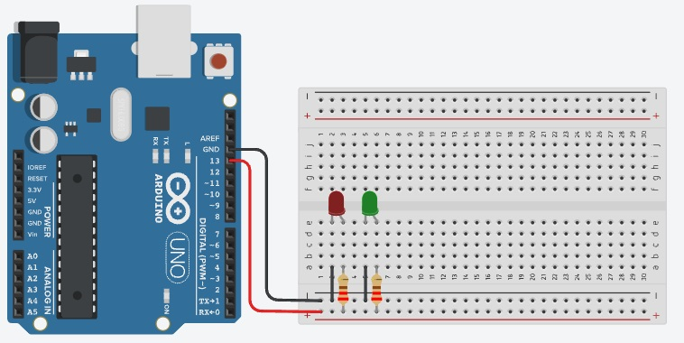

# Projeto Arduíno para manipular 2 leds em sequência

## Contextualização

Neste experimento faremos com que o LED incorporado e dois leds pisquem juntos utilizando o pino digital 13 (pino digital incorporado LED_BUILTIN = 13). 

## Esquema do projeto

## Projeto no Tinkercad

https://www.tinkercad.com/things/10tCTAiUA2H